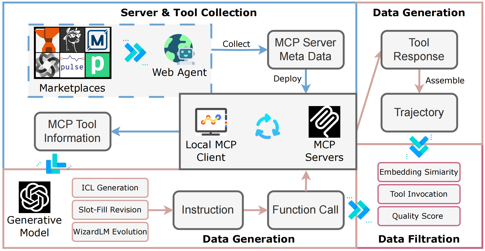
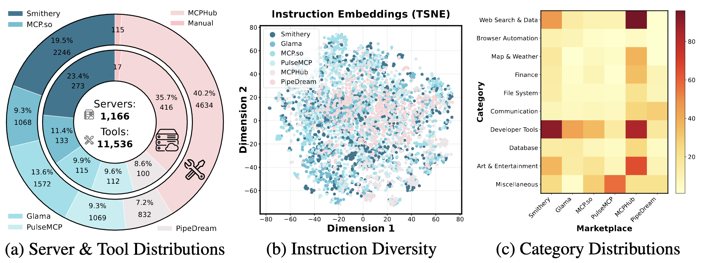
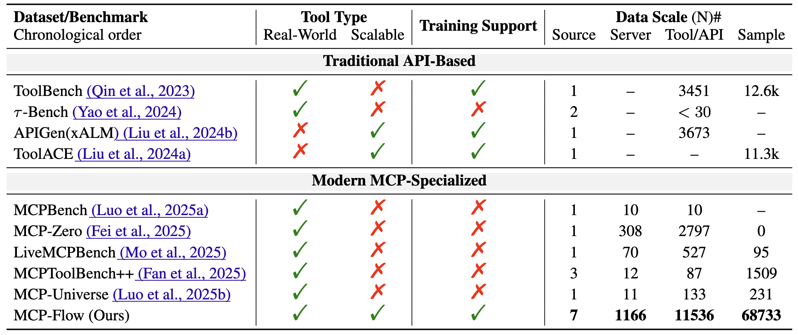

# MCP-Flow

**Facilitating LLM Agents to Master Real-World, Diverse and Scaling MCP Tools**

> 📄 [Paper Url](https://arxiv.org/abs/2510.24284)


## 🌿 分支说明 (Branch Guide)

本项目包含两个主要分支,适用于不同用途:

### 🎯 demo 分支 (推荐用于快速演示)
- **用途**: 展示项目核心算法和最终成果
- **特点**:
  - 包含 80 个高质量测试样本 (100% 通过率, 评分 7-10)
  - 保留成功的 `test_filtration_doubao.py` 脚本
  - 已清理失败的测试文件和临时数据
  - 适合展示、教学和快速验证
- **切换命令**: `git checkout demo`
- **数据位置**: `data/test_output/test_filtered_data_doubao.json`

### 🔧 full-pipeline 分支 (用于完整流程复现)
- **用途**: 运行完整的 1-4 步 pipeline
- **特点**:
  - 包含完整的 `src/main.py` 和所有模块
  - 支持 Server Collection → Tool Extraction → Data Generation → Data Filtration
  - 包含 `requirements.txt` 和所有依赖
  - 适合完整复现、二次开发和扩展研究
- **切换命令**: `git checkout full-pipeline`
- **运行方式**:
  ```bash
  # 1. 安装依赖
  pip install -r requirements.txt

  # 2. 配置 config.yaml (复制 config.yaml.example)
  cp config.yaml.example config.yaml
  # 编辑 config.yaml 填入你的 API 密钥

  # 3. 运行完整 pipeline
  python src/main.py

  # 或分步运行
  python src/main.py --step collect    # 步骤1: 收集服务器
  python src/main.py --step generate   # 步骤2-3: 提取工具+生成数据
  python src/main.py --step filter     # 步骤4: 质量过滤
  ```


## 🗓️ News

* **🧠 Oct 28, 2025** — MCP-Flow is released on [**arXiv**](https://arxiv.org/abs/2510.24284).
* **🛠️ Nov 10, 2025** — We open-source all **server configurations** and **tool information**!


## 📝 Introduction

**MCP-Flow** is an automated **web-agent-driven pipeline** for large-scale **server discovery**, **data synthesis**, and **model training** in the **Model Context Protocol (MCP)** ecosystem.

### 🌐 Key Features

* 🤖 **Automated server collection** from *6 major MCP marketplaces*

  <p align="center">
    
  </p>

* 📊 **Extensive tool coverage:** 1,166 real-world servers, 11,536 tools, and 68K+ instruction–function call pairs

  <p align="center">
    
  </p>

* 🧩 **Scale & diversity** far beyond previous benchmarks

  <p align="center">
    
  </p>


## 📂 Datasets

| Category                         | Path                                           | Description                                                 |
| -------------------------------- | ---------------------------------------------- | ----------------------------------------------------------- |
| 🧠 Function calls & trajectories | `./data/function_call/` & `./data/trajectory/` | Example data; full datasets are released on **HuggingFace** |
| ⚙️ MCP configurations            | `./data/mcp_config/`                           | Configuration files for discovered servers                  |
| 🧰 Tool information              | `./data/tools/`                                | Tool descriptions and schema definitions                    |
| 💻 Source code                   | `./src/`                                       | Core scripts for server deployment    |


## 🛠️ Installation

```bash
git clone https://github.com/zhangxiaoyao391/MCP-Flow.git
cd MCP-Flow
pip install -r requirements.txt
```

## 🚀 Quick Start

### 1. Configuration

Copy the configuration template and fill in your LLM API credentials:

```bash
cp config.yaml.example config.yaml
```

Edit `config.yaml` to add your API keys:

```yaml
llm_providers:
  primary:
    api_key: "YOUR_API_KEY"
    base_url: "YOUR_BASE_URL"
    model: "YOUR_MODEL_NAME"
```

### 2. Run the Pipeline

#### Full Pipeline (Recommended)
```bash
python src/main.py
```

#### Step-by-Step Execution
```bash
# Step 1: Collect MCP servers and tools
python src/main.py --step collect

# Step 2: Generate function calling data
python src/main.py --step generate

# Step 3: Quality filtering
python src/main.py --step filter
```

#### Test Pipeline (Quick validation with 80 samples)
```bash
python test_generation.py          # Generate 80 test samples
python test_filtration_doubao.py   # Filter with quality threshold
```

### 3. View Results

Generated data will be stored in:
- `data/function_call/` - Function calling examples
- `data/trajectory/` - Complete reasoning trajectories
- `data/filtered/` - High-quality filtered data
- `data/test_output/` - Test outputs

## ⚙️ Configuration

### LLM Provider Setup

MCP-Flow supports multiple LLM providers with automatic fallback:

```yaml
llm_providers:
  primary:                    # Primary service (prioritized)
    name: "doubao"
    provider: "openai"        # OpenAI-compatible API
    api_key: "YOUR_KEY"
    base_url: "YOUR_URL"
    model: "Doubao-Seed-1.6"

  fallback:                   # Fallback service (if primary fails)
    name: "openai"
    api_key: "YOUR_KEY"
    model: "gpt-4o-mini"
```

### Data Generation Parameters

```yaml
data_generation:
  instruction_per_tool: 5     # Generate 5 instructions per tool
  evolution_depth: 1          # WizardLM evolution depth (1-3, recommended: 1)
  temperature: 0.7            # Generation temperature
  max_tokens: 4096            # Max tokens
```

### Quality Filtering

```yaml
data_filtering:
  similarity_threshold: 0.8   # Embedding similarity threshold
  quality_score_threshold: 6  # LLM quality score threshold (0-10)
```

## 📊 Test Results

Our test run with **80 samples** achieved:

| Metric | Result |
|--------|--------|
| **Generated Samples** | 80 |
| **Passed Filter** | 80 |
| **Pass Rate** | 100% |
| **Avg Quality Score** | 9.6/10 |
| **Score Range** | 7-10 |

### Sample Output

```json
{
  "server_name": "Weather Server",
  "tool_name": "get_current_weather",
  "instruction_original": "What's the weather in Tokyo?",
  "instruction_evolved": "Can you provide real-time weather including temperature (°C), humidity (%), and wind speed (km/h) for Tokyo's Chiyoda Ward?",
  "function_call": {
    "name": "get_current_weather",
    "arguments": {
      "location": "Tokyo's Chiyoda Ward",
      "units": "celsius"
    }
  }
}
```

## 📁 Project Structure

```
MCP-Flow/
├── src/
│   ├── main.py                     # Main entry point
│   ├── server_collector/           # Server collection module
│   ├── tool_extractor/             # Tool extraction module
│   ├── instruction_generator/      # Instruction generation module
│   ├── data_filter/                # Data filtering module
│   └── utils/                      # Utility functions
├── mcp_config/                     # MCP server configs (from marketplaces)
│   ├── smithery/                   # Smithery marketplace configs
│   └── glama/                      # Glama marketplace configs
├── data/                           # Generated data
│   ├── servers/                    # Server definitions
│   ├── tools/                      # Tool definitions
│   ├── function_call/              # Function call data
│   ├── trajectory/                 # Complete reasoning trajectories
│   ├── filtered/                   # High-quality filtered data
│   └── test_output/                # Test outputs
├── config.yaml.example             # Configuration template
├── test_generation.py              # Test data generation script
├── test_filtration_doubao.py       # Test filtration script
└── README.md                       # Project documentation
```

## 🎯 Use Cases

1. **Function Calling Model Training**
   - Prepare high-quality function calling datasets for LLM fine-tuning
   - Support various tool types and calling scenarios

2. **Agent Behavior Research**
   - Study model tool-use capabilities
   - Analyze function calling reasoning processes

3. **Benchmark Construction**
   - Build function calling capability benchmarks
   - Diverse tool and scenario coverage

4. **Prompt Engineering**
   - Learn high-quality function calling prompt patterns
   - Extract best practices

## 🤝 Contributing

Contributions are welcome! Please feel free to submit Issues and Pull Requests.

1. Fork the project
2. Create a feature branch (`git checkout -b feature/AmazingFeature`)
3. Commit your changes (`git commit -m 'Add some AmazingFeature'`)
4. Push to the branch (`git push origin feature/AmazingFeature`)
5. Open a Pull Request


## 🧾 Citation

If you find **MCP-Flow** useful in your research, please consider citing:
```bibtex
@misc{wang2025mcpflowfacilitatingllmagents,
      title={MCP-Flow: Facilitating LLM Agents to Master Real-World, Diverse and Scaling MCP Tools},
      author={Wenhao Wang and Peizhi Niu and Zhao Xu and Zhaoyu Chen and Jian Du and Yaxin Du and Xianghe Pang and Keduan Huang and Yanfeng Wang and Qiang Yan and Siheng Chen},
      year={2025},
      eprint={2510.24284},
      archivePrefix={arXiv},
      primaryClass={cs.AI},
      url={https://arxiv.org/abs/2510.24284},
}
```


## 📧 Contact
If you have any questions or encounter issues, feel free to open an issue or reach out to the authors directly:

📮 Email: 12321254@zju.edu.cn
💬 WeChat: <br> 
